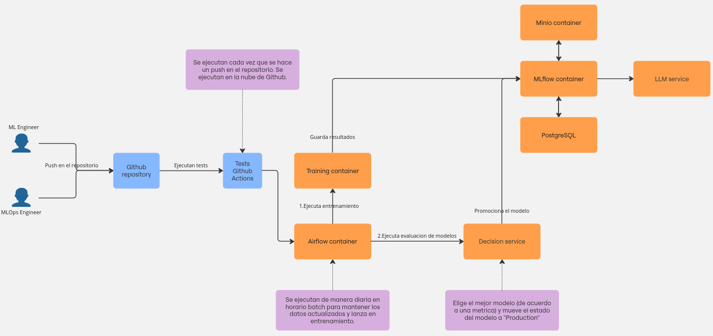

# 🍲 mlops-recetas

> Fine-tuning and productionizing an LLM for Latin American recipe generation — with a full MLOps workflow.


---

## 📌 Overview

This project implements a production-grade MLOps workflow for fine-tuning and serving a conversational LLM capable of generating Latin American recipes. It covers the full lifecycle: data preparation, model training, experiment tracking, pipeline orchestration, and REST deployment.

The model used is **Phi-3.5-mini-instruct** (Microsoft, via Unsloth), chosen for its small footprint and local trainability with 4-bit quantization + LoRA adapters.

---

## 🏗️ Architecture



The solution is composed of three layers:

### 🔧 Training Infrastructure
| Component | Role |
|-----------|------|
| **MLflow** | Experiment tracking & model registry |
| **MinIO** | Artifact storage (S3-compatible) |
| **PostgreSQL** | MLflow metadata backend |

### ⚙️ CI/CD Pipeline
- Automated daily training pipeline via **Airflow**
- Handles retraining as new dataset updates arrive
- Triggers model evaluation and promotion to registry

### 👥 Roles
- **ML Engineer** — Modifies training code, tunes model, contributes improvements
- **MLOps Engineer** — Manages infra, monitors model behavior through logs

---

## 📦 Dataset

Built from web scraping of Latin American recipe sites, then transformed into an instruction-following dataset. Originally developed during the **SomosNLP 2024 Hackathon**.

- 🤗 Dataset: [`somosnlp/recetasdelaabuela_genstruct_it`](https://huggingface.co/datasets/somosnlp/recetasdelaabuela_genstruct_it)
- 📓 Dataset creation notebook: [Google Colab](https://colab.research.google.com/drive/1-7OY5ORmOw0Uy_uazXDDqjWWkwCKvWbL?usp=sharing)

---

## 🚀 Running Locally

> **Note:** Developed on Arch Linux. Docker and an NVIDIA GPU (CUDA) are required for training.

### Prerequisites
- [Docker](https://www.docker.com/) + Docker Compose
- NVIDIA Container Toolkit (for GPU passthrough)
- Git

### Setup

**1. Copy the env template and fill in your credentials:**
```bash
cp mlflow-server/mlflow.env.example mlflow-server/mlflow.env
# edit mlflow-server/mlflow.env with your own values
```

**2. Create shared Docker network:**
```bash
docker network create shared_network
```

**3. Start MLflow tracking server:**
```bash
docker compose --env-file mlflow-server/mlflow.env \
  -f training-infra.docker-compose.yml up -d
```

**4. Start training & evaluation container:**
```bash
docker compose -f model/model-docker-compose.yml up -d
```

**5. Start Airflow scheduler:**
```bash
docker compose -f airflow/docker-compose.yaml up -d
```

---

## ⚠️ Known Limitations

| Area | Status |
|------|--------|
| Cloud deployment | Not implemented — local only |
| Model optimization | Not the primary goal; future iteration |
| REST serving | Basic REST endpoint; no scaling |
| Dataset updates | Manual scrape required; automation is a planned improvement |

---

## 🗺️ Roadmap

- [ ] Automate webscraping pipeline for continuous dataset growth
- [ ] Add model quantization for faster inference
- [ ] Deploy to cloud (GCP / AWS) with auto-scaling
- [ ] Add monitoring dashboard (Grafana + Prometheus)

---

## 🧑‍💻 Author

**Sara** — Data Engineer & MLOps enthusiast  
[](https://github.com/asloth)
