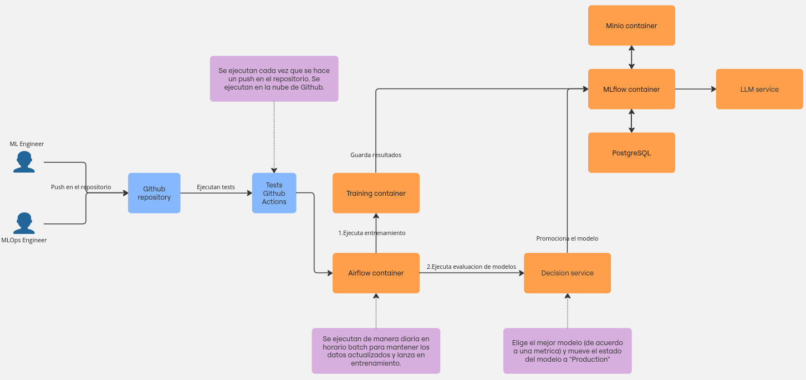

## Objetivo
El objetivo de este proyecto es crear un flujo de desarrollo y productivizacion de un modelo conversacional que pueda asistir en la creacion de recetas latinoamericanas a través del fine tuning de un modelo LLM open source con datos scrapeados de distintas web de recetas.

## Modelado
Se usará el modelo open source Phi3 ya que al ser pequeño podemos entrenarlo en un entorno local.

## Datos
El dataset fue elaborado a partir del webscraping de sitios de recetas y su posterior transformación a un dataset de instrucciones, este se desarrollo durante el marco de la hakathon somosNLP 2024 y se puede encontrar [repo](https://huggingface.co/datasets/somosnlp/recetasdelaabuela_genstruct_it) . El codigo para crear el dataset lo encuentran en este [colab](https://colab.research.google.com/drive/1-7OY5ORmOw0Uy_uazXDDqjWWkwCKvWbL?usp=sharing).

## Inferencia
El modelo responde a demanda, cada vez que el usuario envia un mensaje. El modelo recibe todo el contexto de la conversación y responde.

## Arquitectura de la solución



### Infraestructura de entrenamiento
- Consta de tres elementos principales: minio, MLflow y PostgreSQL.
- Estos componentes interactúan entre sí y son utilizados principalmente por los Ingenieros de ML.

### CI/CD
- Incluye la pipeline de entrenamiento y despliegue del modelo.
- El pipeline se ejecutaria de manera diaria en un horario definido ya que se esperaria que se actualicen los datasets.

### Roles
- Ingeniero de ML: Modifica el código de entrenamiento, agrega mejoras al modelo y contribuye a otros cambios de código
- Ingeniero de MLOps: Gestiona la infraestructura de entrenamiento y servicio, observa el comportamiento del modelo a través de los logs

## Limitaciones
### Este proyecto está actualmente destinado a ejecutarse localmente
No se han hecho previsiones para ejecutar este proyecto utilizando ninguna infraestructura en la nube.
### Optimización del modelo
El modelo no fue optimizado ya que no era el objetivo principal del proyecto, aunque existe potencial para mejorarlo en futuras iteraciones.
### Despliegue en servicio REST
Actualmente solo se espera desplegar el modelo en un servicio REST y que pueda ser consumido.
### Actualización del dataset
Actualmente solo se trabaja con un dataset previamente scrapeado y preprocesado. Una futura mejora es automatizar el webscraping y asi hacer crecer los datos y mantenerlos actualizados.

## Ejecutar localmente
> [!NOTE]
> El proyecto se desarrollo en un entorno Linux (Arch linux)

### Requerimientos
- [Docker](https://www.docker.com/)
- Git
- 
### Comandos
Crear red externa docker:
```
docker network create shared_network
```

Levantar MLflow server:
```bash
docker compose --env-file mlflow-server/mlflow.env -f training-infra.docker-compose.yml up -d
```

Levantar container de entrenamiento y evaluación best-model:
```bash
docker compose -f model/model-docker-compose.yml up -d
```

Levantar airflow server:
```bash
docker compose -f airflow/docker-compose.yaml up -d
```
